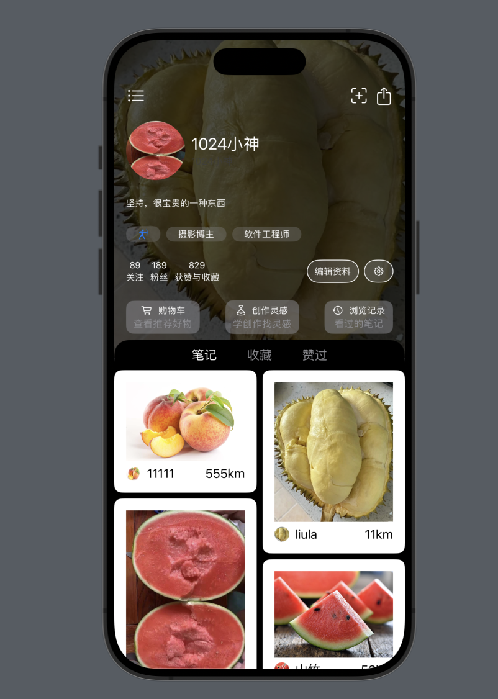
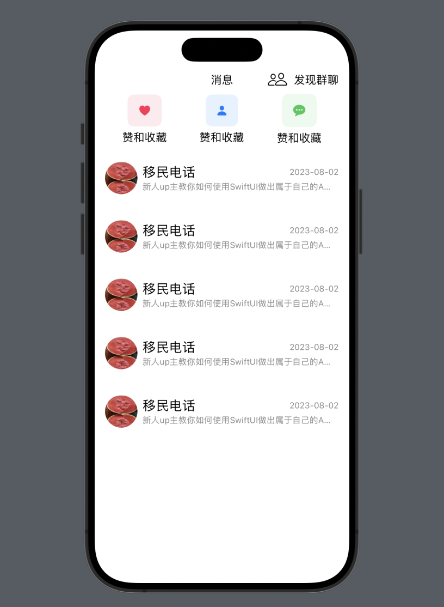

# SwiftBook

一个使用 swift 开发小红书 app 的仓库，学习阶段，不保证代码质量

# 本项目页面预览

# 实际工作项目

1.一个 ipad 软件：扫码识别二维码，并通过 webview 打开网页，就像本地打开一个 app 一样。  
功能：  
1.扫码识别  
2.支持记录  
3.可以锁屏  

 

2.一个抖音直播 mac 客户端  
输入抖音直播网址，可以看直播和弹幕消息
